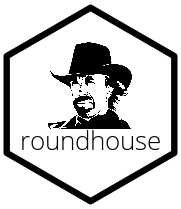
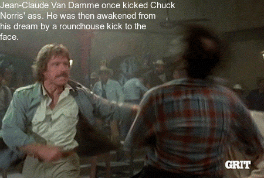

---
output:
  md_document:
    variant: markdown_github
---

```{r setup, echo = FALSE}
knitr::opts_chunk$set(
  cache = FALSE,
  collapse = TRUE,
  message = FALSE, 
  # warning = FALSE,
  comment = "#>",
  fig.align = "left",
  fig.path = "tools/README-"
)
```

# roundhouse: An R wrapper to the ICNDb API 

[](https://travis-ci.org/bgreenwell/roundhouse)
[](https://ci.appveyor.com/project/bgreenwell/roundhouse)

## Overview 

Generate random Chuck Norris facts from the excellent internet Chuck Norris database `r emo::ji("sunglasses")`

## Sample fact

Chuck Norris solved the [travelling salesman problem](https://en.wikipedia.org/wiki/Travelling_salesman_problem) in $O\left(1\right)$ time. Here’s the pseudo-code:
```
Break salesman into N pieces.
Kick each piece to a different city.
```

## Installation

You can install the development version of `roundhouse` from GitHub using
```{r, eval=FALSE}
if (!requireNamespace("devtools")) {
  install.packages("devtools")
}
devtools::install_github("bgreenwell/roundhouse")
```

## Basic usage

`r emo::ji("warning")` **WARNING:** Some facts may contain explicit material!

```{r example-01, eval = FALSE}
# Generate a random fact
roundhouse::random_fact()
#> [1] "Chuck Norris has never been accused of murder because his roundhouse kicks are recognized as 'acts of God.'"

# Generate multiple random facts
roundhouse::random_fact(3)
#> [1] "Chuck Norris doesn't need garbage collection because he doesn't call .Dispose(), he calls .DropKick()."
#> [2] "There are no steroids in baseball. Just players Chuck Norris has breathed on."                         
#> [3] "All browsers support the hex definitions #chuck and #norris for the colors black and blue."

# Print fact categories
roundhouse::fetch_categories()
#> [1] "explicit" "nerdy"

# Generate a random fact with a roundhouse kick!
roundhouse(width = 40, size = 15)
```

<!-- gif <- roundhouse(width = 40, size = 15) -->
<!-- magick::image_write(gif, path = "tools/roundhouse.gif") -->


```{r example-02}
# Or simply supply your own text!
library(roundhouse)
roundhouse("Chuck Norris can’t test for equality because he has no equal.",
           width = 40, size = 25, fps = 5)
```

## Inspirations

* [Lone Wolf McQuade](https://www.youtube.com/watch?v=pfLTbzU0FXo)
