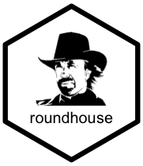
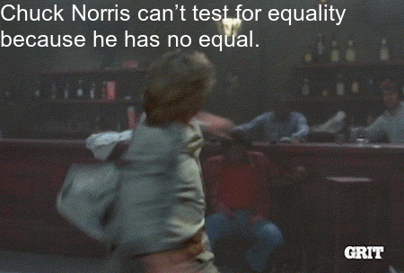

roundhouse: An R wrapper to the ICNDb API 
========================================================================================================================

[](https://travis-ci.org/bgreenwell/roundhouse)
[](https://ci.appveyor.com/project/bgreenwell/roundhouse)

Overview
--------

Generate random Chuck Norris facts from the excellent internet Chuck
Norris database 😎

Sample fact
-----------

Chuck Norris solved the [travelling salesman
problem](https://en.wikipedia.org/wiki/Travelling_salesman_problem) in
*O*(1) time. Here’s the pseudo-code:

    Break salesman into N pieces.
    Kick each piece to a different city.

Installation
------------

You can install the development version of `roundhouse` from GitHub
using

``` r
if (!requireNamespace("devtools")) {
  install.packages("devtools")
}
devtools::install_github("bgreenwell/roundhouse")
```

Basic usage
-----------

⚠️ **WARNING:** Some facts may contain explicit material!

``` r
# Generate a random fact
roundhouse::random_fact()
#> [1] "Chuck Norris has never been accused of murder because his roundhouse kicks are recognized as 'acts of God.'"

# Generate multiple random facts
roundhouse::random_fact(3)
#> [1] "Chuck Norris doesn't need garbage collection because he doesn't call .Dispose(), he calls .DropKick()."
#> [2] "There are no steroids in baseball. Just players Chuck Norris has breathed on."                         
#> [3] "All browsers support the hex definitions #chuck and #norris for the colors black and blue."

# Print fact categories
roundhouse::fetch_categories()
#> [1] "explicit" "nerdy"

# Generate a random fact with a roundhouse kick!
roundhouse(width = 40, size = 15)
```

<!-- gif <- roundhouse(width = 40, size = 15) -->
<!-- magick::image_write(gif, path = "tools/roundhouse.gif") -->


``` r
# Or simply supply your own text!
library(roundhouse)
roundhouse("Chuck Norris can’t test for equality because he has no equal.",
           width = 40, size = 25, fps = 5)
```



Inspirations
------------

-   [Lone Wolf McQuade](https://www.youtube.com/watch?v=pfLTbzU0FXo)
